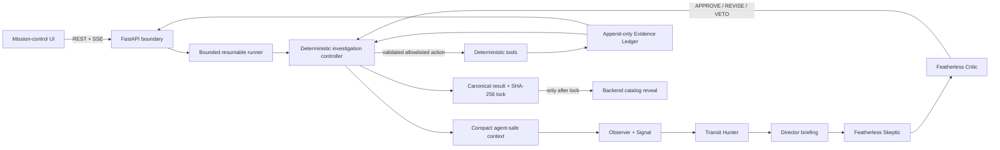

# ExoSwarm

**AI Mission Control for Agent-Orchestrated Exoplanet Investigation**

ExoSwarm is an AI-orchestrated TESS investigation system that uses deterministic astronomy tools to test and falsify competing explanations for transit-like signals, adaptively chooses which scientific evidence to seek next, and locks its measurements before comparing them with NASA ground truth.

ExoSwarm is **not** an LLM planet detector. Numerical measurements belong to deterministic scientific code. The agent layer decides what evidence to seek next, which competing hypothesis deserves attention, and when the implemented evidence is sufficient to stop.

## Who it is for

ExoSwarm is a reference implementation for engineers building auditable AI decision systems in
science, finance, security, and other evidence-heavy domains. The reusable pattern is an LLM that
chooses which bounded, potentially expensive deterministic analysis to run next while a typed
ledger records what happened. Its blind-lock protocol also addresses benchmark contamination: a
result on public data is more credible when the system can prove the decision layer could not see
the answer before committing its result.

## Core architecture

The project deliberately combines a deterministic workflow with bounded agentic control:

- **Deterministic scientific layer:** TESS loading, preprocessing, BLS, phase folding, measurements, odd/even checks, secondary-eclipse checks, harmonic tests, contamination diagnostics, hypothesis-update rules, result locking, and catalog gating.
- **Control layer:** deterministic orchestration owns phases, routes, budgets, permissions, retries, stopping, and dispositions. Six bounded Featherless roles provide specialist briefs and action review without gaining mutation authority.
- **Mandatory baseline:** safety-critical vetting is code-enforced and cannot be skipped by the model.
- **Adaptive layer:** the Skeptic selects a discriminating follow-up experiment from a bounded registry; the Critic returns APPROVE, REVISE, or VETO.
- **Blind protocol:** agents see opaque target IDs; recognizable identity and NASA ground truth are unavailable until the result is locked.
- **Evidence Ledger:** append-only structured scientific evidence powers agent context, auditability, UI storytelling, evaluation, and reproducibility.



The important boundary is proposal versus authority: models select or review bounded actions, the
controller validates and authorizes them, deterministic tools produce measurements, and durable
state plus traces explain every branch without storing hidden chain-of-thought.

## Inference layer

Featherless.ai is the intended live inference provider, with `DeepSeek-V4-Flash-0731` as the single
primary model. The API supports Observer, Signal, Transit Hunter, Director, Skeptic, and Critic
through isolated structured contexts when
`FEATHERLESS_API_KEY` is configured; offline tests inject a scripted client. Every run exposes
measured call count, input/output tokens, schema-valid rate, repair rate, fallback rate, latency,
and model identity. Raw light-curve samples sent to the model remain **zero**; models receive
compact evidence packets with deterministic measurements and provenance references.

See [`docs/inference.md`](docs/inference.md) for the implementation and reporting contract. Never
replace unavailable metrics with estimates in the README, UI, demo, or artifacts.

## 48-hour stack

| Layer | Technology |
|---|---|
| Frontend | Next.js + TypeScript |
| Styling | Tailwind CSS + shadcn/ui |
| Icons | Heroicons |
| Scientific charts | Plotly.js + react-plotly.js |
| Central 3D scene | React Three Fiber, one mission-control scene only |
| Backend | FastAPI + Uvicorn |
| Realtime | Server-Sent Events (SSE) |
| Agent orchestration | LangGraph |
| Schemas | Pydantic v2 |
| LLM client/provider | OpenAI Python SDK -> Featherless AI |
| Primary model | DeepSeek-V4-Flash-0731 |
| TESS/science | Lightkurve, Astropy, NumPy, SciPy, Pandas |
| Reproducible plots | Matplotlib |
| HTTP | httpx |
| Python tooling | Python 3.12, uv, pytest, pytest-asyncio, Ruff |
| JS tooling | pnpm, ESLint, TypeScript |
| CI/deploy | GitHub Actions, Vercel, Railway, Docker |

**Visualization rule:** use React Three Fiber only for the single central mission-control visualization. All scientific charts and diagnostics stay in Plotly.

## Repository layout

The intended scaffold is documented in [`docs/03_REPO_SCAFFOLD.md`](docs/03_REPO_SCAFFOLD.md). At a high level:

```text
apps/web/                    Next.js mission-control frontend
apps/api/                    FastAPI + ExoSwarm Python package
data/                        cached scientific inputs and target manifests
runs/                        reproducible run artifacts
evals/                       curated evaluation cases and reports
scripts/                     reproducibility and utility entrypoints
docs/                        architecture and implementation contracts
.agents/skills/              coding-agent skill files
```

## Scientific path

The shippable P0 scientific path is:

```text
cached TESS data
  -> quality/preprocessing
  -> BLS search
  -> phase folding
  -> period/depth/duration/SNR
  -> odd/even test
  -> secondary-eclipse test
  -> basic contamination context
  -> Skeptic/Critic-selected P/2-P-2P harmonic test when useful
```

A real pixel/centroid diagnostic is an optional P1 differentiator after architecture clarity,
agent observability, documentation, and demo reliability are strong. Keep it only when a real
cached TPF case passes a short acceptance check and it materially improves the visible demo. If it
misses that checkpoint, ship honestly labeled neighbor/contamination context and do not imply
pixel-level localization.

All measurements must have explicit units, method/provenance, and explicit failure states. Where uncertainty is not available, report a declared tolerance rather than fake precision.

## Investigation path

```text
observe
  -> prepare signal
  -> detect candidate
  -> establish competing hypotheses
  -> complete mandatory baseline vetting
  -> Skeptic selects adaptive experiment
  -> Critic reviews
  -> deterministic tool executes
  -> Evidence Ledger appends result
  -> deterministic hypothesis update
  -> continue or stop
  -> lock result + SHA-256
  -> unlock NASA reveal
```

A valid demo must show one planet-like case and one false-positive/eclipsing-binary case taking
visibly different evidence-driven trajectories. A third inconclusive case belongs in the compact
evaluation suite but need not consume the primary three-minute demo.

## Blindness and result lock

Before `RESULT_LOCKED`, agent-visible code paths must not expose:

- recognizable target identity when avoidable,
- known planetary parameters,
- NASA confirmation status,
- ground-truth catalog values,
- a ground-truth lookup tool.

The final result is serialized and hashed before any reveal. The catalog is an evaluator, not an input to the investigation.

## Artifacts

Conceptual run output:

```text
runs/
  TARGET-X17/
    <run-id>/
      state.json
      trace.jsonl
      agent_decisions.jsonl
      result.json
      result.json.sha256
      inference_summary.json
      reveal.json             # only after lock + reveal
      artifacts/
        <action-id>.candidate-search.json
```

`make reproduce` is the cached/no-network reproduction path. It runs the complete TARGET-P21
investigation under a declared scripted decision policy, locks the result, verifies the SHA-256 of
the exact persisted bytes, performs the gated catalog reveal, and verifies that the reveal refers
to the same hash.

## Project status and scope

The default API now composes a versioned backend-only target mapping, bounded/resumable run service,
the live six-role Featherless adapter, strict primary/repair/fallback validation, role checkpoints,
append-only agent decisions, per-attempt prompt/thinking provenance, and a derived run-level
inference summary. Validated Transit Hunter and Director briefings are promoted into the Skeptic's
bounded context while the Critic stays isolated. The exact configured DeepSeek model uses verified
provider thinking for the non-authoritative Director only. The production mandatory path runs cached TESS BLS,
odd/even, secondary-eclipse, and contamination screening; bounded harmonic analysis and explicit
zero-cost STOP are adaptive choices. Five cached-real opaque targets now cover a clean confirmed
planet that survives vetting, two hot-Jupiter evidence profiles, a cataloged eclipsing binary that
is rejected, and an intentionally inconclusive shallow planet signal. A locked five-case evaluator
checks period/harmonic recovery, dispositions, complete mandatory diagnostics, result/reveal hashes,
and the zero-raw-sample agent-context invariant. Safe artifact metadata and backend-only post-lock
catalog comparisons are implemented. Pixel/centroid science and the mission-control integration
remain deferred.

## Scaffold quick start

Requirements: Python 3.12 with `uv`, Node.js 24, and `pnpm` 11.

Copy `.env.example` to `.env`. Set `FEATHERLESS_API_KEY` for live six-role inference; leave it
blank for deterministic offline tests and cached reproduction. The example already contains the
supported model, provider URL, promoted Director thinking profile, bounded inference
limits, run budgets, and local API URL. Rerun the exact-model preflight and reset the confirmed-role
list before changing model identity. Do not put secrets in committed files.

```bash
uv sync --project apps/api --extra science --extra agents
pnpm install --frozen-lockfile
make test
make lint
make build
make eval-real-tess
```

For local development, run `make dev-api` and `make dev-web` in separate terminals. `make reproduce`
uses the committed cached-real FITS inputs, never contacts an astronomy-data service, and never
generates placeholder science. With a Featherless key configured, run the live gates documented in
[`docs/inference.md`](docs/inference.md).

Build the production backend container from the repository root so cached target inputs and the
frozen backend lock plus the `science` and `agents` dependency groups are included:

```bash
docker build -f apps/api/Dockerfile -t exoswarm-api .
docker run --rm -p 8000:8000 --env-file .env exoswarm-api
```

Run one API process per runs directory. The controller cache and JSON/JSONL artifact coordination
are process-local/file-backed and are not safe for multiple Uvicorn workers sharing the same
directory.

Do not invent capabilities or fake demo values while completing the ranked final-stretch work. See:

- [`AGENTS.md`](AGENTS.md) - repository-wide coding-agent rules.
- [`docs/00_SOURCE_OF_TRUTH.md`](docs/00_SOURCE_OF_TRUTH.md) - source-derived constraints vs scaffold conventions.
- [`docs/11_48H_SCOPE_AND_BUILD_ORDER.md`](docs/11_48H_SCOPE_AND_BUILD_ORDER.md) - P0/P1/deferred priority and implementation order.
- [`docs/13_HARNESS_SCAFFOLD.md`](docs/13_HARNESS_SCAFFOLD.md) - implemented harness boundary and authority classes.
- [`docs/15_FINAL_STRETCH_PRIORITIES.md`](docs/15_FINAL_STRETCH_PRIORITIES.md) - current cut list, sequencing, and submission gates.
- [`docs/inference.md`](docs/inference.md) - Featherless integration and measured inference-statistics contract.

## References and data attribution

- [Featherless.ai documentation](https://featherless.ai/docs) — hosted inference provider used by
  the bounded six-role pipeline.
- [NASA Exoplanet Archive](https://exoplanetarchive.ipac.caltech.edu/) — post-lock catalog
  comparison source; never an agent input during investigation.
- [MAST TESS data archive](https://archive.stsci.edu/missions-and-data/tess) — source of the public
  cached SPOC light-curve products used by the reproducible backend cases.
- [TESS mission](https://tess.mit.edu/) — mission and instrument context.
- [SHERLOCK](https://github.com/franpoz/SHERLOCK) and
  [WATSON](https://github.com/planetHunters/watson) — MIT-licensed upstream implementation
  references; adopted and rejected patterns are recorded precisely in
  [`docs/14_SCIENCE_VERTICAL_SLICE.md`](docs/14_SCIENCE_VERTICAL_SLICE.md).

## Scientific claim language

Preferred wording:

> The planetary interpretation survives the implemented vetting.

Avoid claims that ExoSwarm autonomously confirms or discovers planets. If NASA later reveals a confirmed-planet status, that status belongs to the external catalog, not to ExoSwarm's photometric vetting.
