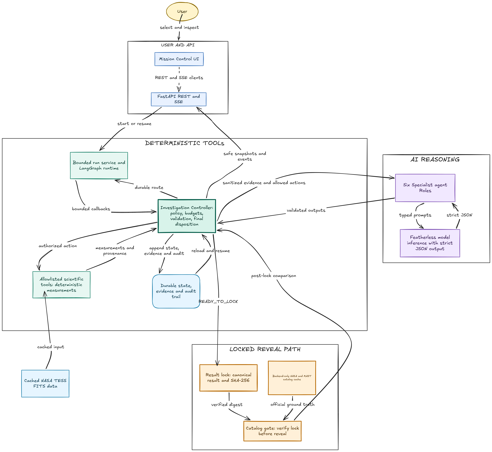
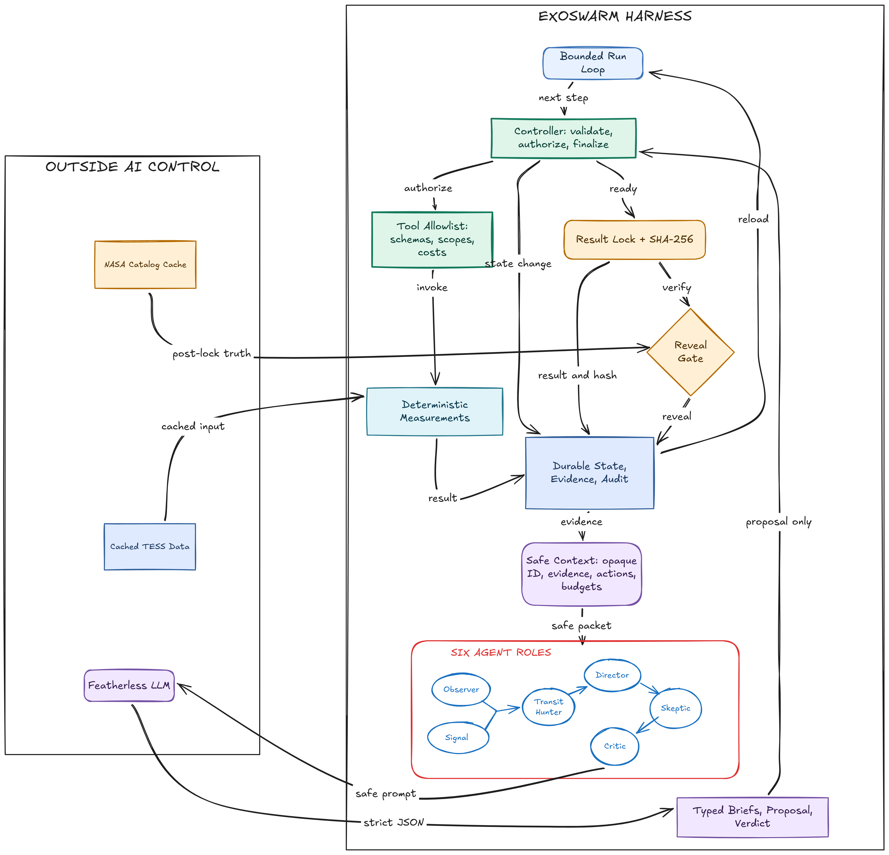

<div align="center">

# ExoSwarm

**Auditable AI investigation of candidate exoplanet signals in NASA TESS observations.**

<a href="https://exoswarm.duckdns.org"></a>
<a href="#try-the-reproducible-path"></a>

[](https://github.com/AzzouzAimen/exoswarm/actions/workflows/ci.yml)
[](LICENSE)
[](https://www.python.org/)
[](https://fastapi.tiangolo.com/)
[](https://nextjs.org/)

[Architecture](#system-architecture) · [Agent harness](#what-can-the-ai-control) · [Quick start](#quick-start-full-local-application) · [Verification](#reproducibility-and-verification) · [Documentation](#engineering-documentation)

</div>

A planet crossing its star can cause a small, repeating dip in brightness. Other stars, stellar
eclipses, and instrumental effects can produce convincing look-alikes, so finding a dip is only the
start of an investigation. ExoSwarm searches cached TESS observations, runs a mandatory vetting
baseline, and then lets bounded AI roles decide which approved test would be most informative next.

The architecture separates judgment from authority:

- **Models interpret and propose.** Six specialist roles receive compact, structured evidence—not
  raw light curves, local files, recognizable target identities, or catalog answers.
- **Application code authorizes.** A deterministic controller validates schemas, permissions,
  preconditions, duplicate actions, and hard budgets before anything runs.
- **Scientific tools measure.** Typed Python functions compute every period, depth, duration,
  signal-to-noise value, and vetting diagnostic shown by the system.
- **The viewer gets the answer key immediately; the agents never do.** A separate viewer-only API
  shows the official identity and catalog reference from the start, while every agent packet,
  run snapshot, and event remains opaque. The finished result is compared automatically.

This makes exoplanet vetting a concrete test case for a broader engineering question: how can an AI
choose useful next actions without becoming the authority over execution, measurements, or the
answer key?

## Demo

The hosted Mission Control demo is available at <https://exoswarm.duckdns.org>. The cached
reproducible path below runs a complete investigation without a model key or astronomy-network
access.

## Try the reproducible path

With Python 3.12 and [`uv`](https://docs.astral.sh/uv/) installed, this command runs a complete
cached TESS investigation from the repository root:

```bash
uv run --project apps/api --extra science python scripts/reproduce.py
```

It requires no model API key and makes no astronomy-network request. A scripted decision client
exercises the same controller boundary, while committed TESS FITS data supplies the scientific
tools. The script verifies mandatory diagnostics, writes and hashes the canonical result in a
temporary run directory, verifies the retained cryptographic audit artifacts, checks that the
catalog comparison references the same hash, and prints a JSON `PASS` summary. On systems with GNU Make, `make reproduce` is the
equivalent shortcut.

## System architecture

The repository pairs a mission-control web interface with a FastAPI investigation service. The
backend exposes REST run control, a UI-safe mission-control projection, bounded scientific plot
projections, and ordered Server-Sent Events (SSE). The shell uses the API backend by default;
deterministic fixture playback remains an explicit offline mode. LangGraph supplies the explicit
backend routing topology, but JSON/JSONL run artifacts—not graph memory or a chat transcript—remain
the durable source of truth.



External systems are shown outside the deterministic authority boundary. Normal cached runs do not
contact MAST or the NASA Exoplanet Archive; their source products and viewer-reference catalog records are
versioned locally with provenance.

## What can the AI control?

ExoSwarm uses six roles because they have different evidence access and responsibilities—not to
simulate an unconstrained group chat.

| Role | Bounded responsibility | Authority |
|---|---|---|
| Observer | Summarize observation quality and limitations | Advisory only |
| Signal | Interpret candidate-pattern evidence using a fixed vocabulary | Advisory only |
| Transit Hunter | Rank candidate viability and currently allowed follow-ups | Advisory only |
| Director | Echo the controller's binding route/disposition and provide a concise brief | Cannot change the route or result |
| Skeptic | Select the strongest alternative explanation and one allowed discriminating action | Proposal only |
| Critic | Return `APPROVE`, `REVISE`, or `VETO` for the exact proposal | Review only |

The normal adaptive path uses the Director twice—once for a briefing and once at finalization—so six
roles may produce seven calls. Each receives safe context from durable evidence; typed outputs return
to the controller for validation, authorization, and stable-order commit.



In short: **the model proposes, the controller authorizes, and deterministic tools measure.** Model
output never becomes a scientific measurement. Each accepted model decision is schema-validated,
cited to evidence IDs, and recorded without storing hidden chain-of-thought.

## How an investigation works

1. **Load an opaque target.** The public run sees an ID such as `TARGET-P21`; the backend resolves
   the committed TESS file without exposing its recognizable identity to agents.
2. **Search for a repeating dip.** Deterministic preprocessing and Box Least Squares (BLS) estimate
   the candidate period, epoch, duration, depth, and depth signal-to-noise ratio.
3. **Run the mandatory baseline.** Code—not an LLM—requires signal-quality, odd/even transit,
   secondary-eclipse, and contamination checks.
4. **Investigate ambiguity.** If evidence remains unresolved, advisory roles brief the Skeptic. The
   Skeptic may propose an available harmonic test or zero-cost stop; the Critic reviews it.
5. **Validate and execute.** The controller checks the exact proposal against the typed tool
   registry and remaining budgets, then executes approved science in an isolated subprocess.
6. **Update durable evidence.** Measurements, units, warnings, provenance, decisions, budgets, and
   transitions are persisted in state plus append-only JSONL records.
7. **Finalize without the answer key.** Application rules map evidence codes to a cautious
   disposition such as `PLANETARY_INTERPRETATION_SURVIVES_IMPLEMENTED_VETTING` or
   `INCONCLUSIVE_ADDITIONAL_DATA_REQUIRED`.
8. **Compare automatically.** The viewer-only catalog projection is shown throughout the demo, then
   the completed independent disposition and measurements appear beside it with a clear match,
   partial-match, mismatch, or insufficient-evidence verdict. Agents never receive that projection.

This is photometric vetting, not planet confirmation. A result means that a planetary interpretation
survived—or did not survive—the implemented tests. Any confirmed status shown in the viewer reference belongs
to the external catalog.

## Quick start: full local application

### Prerequisites

- Python **3.12** (the package supports `>=3.12,<3.14`; CI uses 3.12)
- [`uv`](https://docs.astral.sh/uv/)
- Node.js **24**
- pnpm **11.10.0**

### 1. Clone and install

```bash
git clone https://github.com/AzzouzAimen/exoswarm.git
cd exoswarm
uv sync --project apps/api --extra science --extra agents --frozen
pnpm install --frozen-lockfile
```

### 2. Configure

macOS/Linux:

```bash
cp .env.example .env
```

PowerShell:

```powershell
Copy-Item .env.example .env
```

The defaults point the browser to `http://localhost:8000` and store local run artifacts under
`runs/`. Leave `FEATHERLESS_API_KEY` blank for tests and the cached reproduction. To exercise the
provider-backed six-role path, set it to a Featherless API key; the configured OpenAI-compatible endpoint and
model are already declared in `.env.example`.

Mission Control uses the API run mode by default. Set
`NEXT_PUBLIC_EXOSWARM_DATA_MODE=fixture` before starting or building the web application only when
you need the explicit offline presentation fallback. Set `EXOSWARM_CORS_ORIGINS` to the deployed
frontend origin allowlist when it differs from the development default of
`http://localhost:3000`.

### 3. Start both services

Terminal 1:

```bash
uv run --project apps/api --extra science --extra agents uvicorn exoswarm.api.app:app --reload --port 8000
```

Terminal 2:

```bash
pnpm --dir apps/web dev
```

Open:

- Mission Control: <http://localhost:3000>
- API documentation: <http://localhost:8000/docs>
- Health check: <http://localhost:8000/health>

On systems with GNU Make, `make dev-api` and `make dev-web` provide the same two start commands.
Use one API process per runs directory: lifecycle leases and local artifact coordination are
process-local/file-backed and are not designed for multiple Uvicorn workers sharing one directory.

### Containerized backend

Build from the repository root so the image includes the frozen backend dependencies and committed
cached inputs:

```bash
docker build -f apps/api/Dockerfile -t exoswarm-api .
docker run --rm -p 8000:8000 --env-file .env exoswarm-api
```

## Deploy the demo to the VPS

The production Compose setup runs the FastAPI service, the optimized Next.js server, and Caddy as
the HTTPS reverse proxy. Caddy obtains and renews the TLS certificate automatically. Run exactly one
API container because ExoSwarm's durable run coordination is intentionally single-process.

Before starting, set the DuckDNS `exoswarm` record to `84.235.226.37` in the DuckDNS dashboard. On a
clean VPS, allow inbound TCP ports `80` and `443`, install Docker Engine with the Compose plugin,
clone the repository, and run:

```bash
cp .env.example .env
nano .env                         # set FEATHERLESS_API_KEY only
docker compose up -d --build
docker compose ps
```

Open <https://exoswarm.duckdns.org>. The public `/api/*` routes are proxied to FastAPI on the same
origin, including the SSE event stream; the API and web ports are not exposed directly. Investigation
artifacts and Caddy certificates live in named Docker volumes and survive container restarts.

Useful operations:

```bash
docker compose logs -f
docker compose restart
docker compose down
```

`docker compose down` keeps the named volumes. Do not add `--volumes` unless you intentionally want
to delete saved investigation runs and the cached TLS state.

### Shared demo VPS

The current demo VPS already uses ports `80` and `443` for other websites. Do not stop or replace
that ingress. The VPS override runs ExoSwarm independently on HTTP port `8081`:

```bash
docker compose -f compose.yaml -f compose.vps.yaml up -d --build
docker compose -f compose.yaml -f compose.vps.yaml ps
```

Allow inbound TCP port `8081` in both the Oracle Cloud ingress rules and the host firewall, then open
<http://exoswarm.duckdns.org:8081>. This override changes the browser API URL, CORS origin, Caddy
listener, and published port together so API requests and SSE remain same-origin.

## Reproducibility and verification

The offline suites inject scripted decisions at the model-client seam while the scientific tools
operate on controlled fixtures for failure and edge cases and five cached public SPOC light
curves exercise the complete backend against locked expectations.

| Command | What it verifies |
|---|---|
| `make reproduce` | One cached TESS investigation, mandatory diagnostics, exact-byte lock, gated reveal, and matching hashes |
| `make test` | Backend, science, harness, API, privacy, persistence, and lock/reveal tests |
| `pnpm --dir apps/web test` | Frontend state and component behavior |
| `make lint` | Ruff, ESLint, and TypeScript checks |
| `make build` | Backend import smoke test and optimized Next.js build |
| `make eval-real-tess` | Locked five-case cached TESS suite: signal recovery, dispositions, mandatory evidence, hashes, and zero raw model samples |

If GNU Make is unavailable, run the underlying cross-platform commands directly:

```powershell
uv run --project apps/api --extra science --extra agents pytest -c apps/api/pyproject.toml
uv run --project apps/api ruff check apps/api/src apps/api/tests scripts evals
pnpm --dir apps/web lint
pnpm --dir apps/web typecheck
pnpm --dir apps/web build
uv run --project apps/api --extra science --extra agents python scripts/run_cached_real_tess_evals.py
```

The repository's CI runs frozen installs, backend and frontend checks, harness evaluation,
reproduction, a backend container build, and HTTP smoke tests. Live Featherless canaries and the
full API/SSE/model gate are credentialed opt-in checks documented in
[`docs/inference.md`](docs/inference.md).

## Audit artifacts

Each persistent run uses a boundary such as:

```text
runs/<opaque-target>/<run-id>/
├── state.json                 # atomic durable snapshot and restart authority
├── trace.jsonl                # ordered transitions, calls, failures, and budgets
├── agent_decisions.jsonl      # append-only validated role outputs/checkpoints
├── evidence.jsonl             # append-only scientific results and provenance
├── inference_summary.json     # measured provider telemetry; missing means not measured
├── result.json                # canonical pre-reveal result
├── result.json.sha256         # hash of the exact result bytes
├── reveal.json                # created only after lock verification
└── artifacts/                 # deterministic science data and plot projections
```

`state.json` is replaced atomically as state changes. The evidence and agent-decision ledgers open
in append mode and reject duplicate evidence/action or role/phase/context identities. This is a
local, inspectable audit design—not an event-sourced database or a claim of cryptographic security.
SHA-256 makes the pre-reveal result tamper-evident; it does not protect a machine whose backend data
or code has already been compromised.

## Technology

| Layer | Current implementation |
|---|---|
| Web | Next.js 16, React 19, TypeScript, Tailwind CSS, Plotly.js, React Three Fiber |
| API and events | FastAPI, Pydantic v2, Uvicorn, REST + SSE |
| Investigation topology | LangGraph with a disposable `run_id` routing envelope |
| Durable state | Local JSON/JSONL artifacts with atomic snapshots and append-only ledgers |
| Model inference | OpenAI Python client against Featherless.ai; DeepSeek V4 Flash configuration |
| Science | Lightkurve, Astropy, NumPy, SciPy, Pandas, Matplotlib |
| Tooling | Python 3.12, uv, pytest, Ruff, pnpm, ESLint, Vitest, GitHub Actions, Docker |

## Scope and limitations

- ExoSwarm evaluates a fixed, opaque set of cached single-sector TESS light curves. It is not a
  general target-search service and does not stitch multiple sectors.
- Mission Control uses API state and ordered SSE events by default. The explicit fixture
  mode remains useful for offline presentation and frontend regression tests, but it never activates
  automatically after a live API or model failure.
- The mandatory implementation covers BLS signal search, odd/even comparison, secondary-event
  search, and aggregate contamination context. Harmonic testing is adaptive.
- Pixel/centroid localization is registered as an unavailable capability because the committed
  targets do not include cached target-pixel files. The UI and documentation must not imply that
  ExoSwarm spatially localized a source.
- The cached `CROWDSAP` fallback measures aggregate aperture contamination capacity; it does not
  identify a neighboring source.
- Local JSON/JSONL persistence is intentionally single-process. There is no authentication,
  database, distributed queue, or multi-worker coordination layer.
- Provider availability and structured-output quality affect the live role path. Retries and
  fallback behavior are bounded and traced; offline reproduction remains available without a key.

## Data, scientific sources, and attribution

### Data and ground truth

- [NASA: What is a transit?](https://science.nasa.gov/exoplanets/whats-a-transit/) explains why a
  planet crossing a star produces a brightness dip and what period and depth can reveal.
- [MAST's TESS archive](https://archive.stsci.edu/missions-and-data/tess) is the source service for
  the public calibrated light-curve products cached in this repository. Acquisition metadata and
  checksums are preserved under `data/ground_truth/`; routine runs do not call MAST.
- The [NASA Exoplanet Archive overview](https://exoplanetarchive.ipac.caltech.edu/docs/intro.html)
  describes the catalog service used for the separate viewer-only comparison. Catalog status is
  external reference data, not an input to ExoSwarm's investigation or any model call.

### Scientific methods and software

- ExoSwarm uses Astropy's
  [`BoxLeastSquares`](https://docs.astropy.org/en/stable/timeseries/bls.html), a periodogram for
  transit-like and eclipsing-binary signals in photometric time series.
- Pipeline ordering and period/harmonic trial patterns were adapted from the MIT-licensed
  [SHERLOCK](https://github.com/franpoz/SHERLOCK) project. The per-transit odd/even depth-series
  pattern was adapted from the MIT-licensed [WATSON](https://github.com/planetHunters/watson)
  project. Exact upstream commits, borrowed/adapted boundaries, rejected patterns, and regression
  evidence are recorded in [`docs/14_SCIENCE_VERTICAL_SLICE.md`](docs/14_SCIENCE_VERTICAL_SLICE.md).

### Agent and inference infrastructure

- [LangGraph's Graph API](https://docs.langchain.com/oss/python/langgraph/graph-api) provides the
  node-and-edge workflow primitive used for investigation sequencing. ExoSwarm deliberately keeps
  its scientific state in its own durable artifacts.
- [Featherless's API documentation](https://featherless.ai/docs/api-overview-and-common-options)
  documents the OpenAI-compatible inference endpoint used by the live role adapter. ExoSwarm—not
  the provider—owns role schemas, validation, budgets, traces, and tool execution.

## Engineering documentation

- [`docs/02_ARCHITECTURE.md`](docs/02_ARCHITECTURE.md) — component responsibilities, topology, and
  trust boundary
- [`docs/05_AGENT_RUNTIME.md`](docs/05_AGENT_RUNTIME.md) — role contracts, loop limits, validation,
  context, and traces
- [`docs/06_SCIENCE_CONTRACTS.md`](docs/06_SCIENCE_CONTRACTS.md) — numerical tool contracts, units,
  failures, and scientific claim language
- [`docs/07_DATA_ARTIFACTS_BLINDING.md`](docs/07_DATA_ARTIFACTS_BLINDING.md) — data boundary,
  evidence ledger, lock, and reveal protocol
- [`docs/08_API_EVENTS.md`](docs/08_API_EVENTS.md) — REST and SSE contracts
- [`docs/10_TESTING_EVALS.md`](docs/10_TESTING_EVALS.md) — layered tests, evaluations, and release
  gates
- [`docs/inference.md`](docs/inference.md) — Featherless integration, structured-output policy, and
  measured telemetry contract

## License

ExoSwarm is available under the [MIT License](LICENSE).
