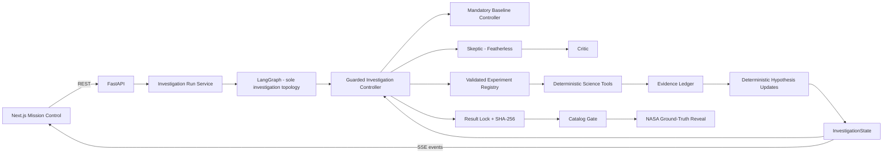
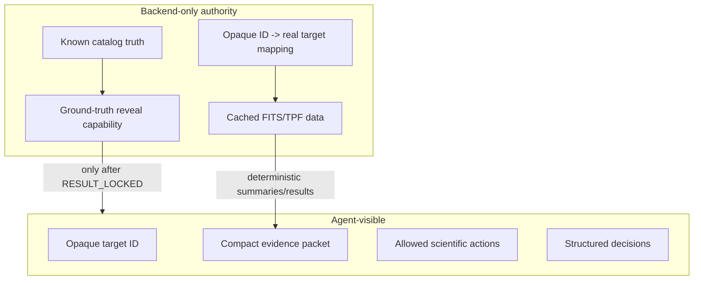

# Architecture

## Architectural principle

ExoSwarm is a deterministic scientific workflow with bounded agentic control at the decision points that benefit from interpretation and experiment selection.



## Responsibility split

| Component | Responsibility |
|---|---|
| Investigation Run Service | process lifecycle, wall-clock timeout, leases, API start/resume |
| LangGraph | node sequencing and conditional investigation routing |
| Investigation Controller | public facade, deterministic policy, validation, and guarded durable mutations |
| InvestigationState + artifacts | sole durable source of truth and restart authority |
| Skeptic/Critic adapters | bounded model inference |
| Tool registry/science | validated deterministic execution and measurements |
| Result lock/catalog gate | backend security authority |

The graph is compiled without a LangGraph checkpointer. Its small `run_id`-keyed state is transient
and reconstructible; it never stores scientific arrays, raw paths, ground truth, Evidence Ledger
contents, budgets, or disposition logic.

### Deterministic application code owns

- data loading and caching,
- quality filtering and preprocessing execution,
- BLS and all numerical measurements,
- tool parameter validation and preconditions,
- mandatory baseline diagnostics,
- evidence serialization,
- hypothesis-state update rules,
- permissions and tool availability,
- max turns / experiment budget / repeated-action checks,
- result lock and hash,
- catalog gating and reveal authority,
- persistence and trace events,
- scientific numeric provenance guardrails.

### Models may own bounded judgment

- interpreting compact observation-quality summaries,
- choosing among allowed preprocessing strategies when genuinely evidence-dependent,
- selecting a candidate-related action from a bounded set,
- identifying the strongest unresolved alternative hypothesis,
- selecting one discriminating adaptive experiment,
- reviewing whether that experiment is redundant/informative,
- deciding to stop when the structured stopping conditions allow judgment,
- generating concise non-numeric UI explanations grounded in evidence.

## LangGraph + bounded specialists

LangGraph owns investigation sequencing, while deterministic controller operations authorize and
persist every mutation. "Scientific Director" names the typed deterministic graph-routing adapter;
it is not a separate P0 LLM agent. Do not add a model call merely to preserve the role name.
Specialist contexts are isolated and narrow. The P0 live inference surface is Skeptic selection plus
Critic review; after that path is stable, Observer or Signal calls are worthwhile P1 additions only
when their bounded decisions visibly change a trajectory.

| Role | Primary objective | Typical output |
|---|---|---|
| LangGraph / Director | deterministic node sequencing from controller-classified durable state | next guarded node / terminal node |
| Investigation controller | mandatory policy, budgets, validation, failures, persistence, and terminal mutations | authorized operation / durable state change |
| Observer | optional bounded review only if it changes a real decision | quality/preparation decision |
| Signal Agent | optional bounded choice among allowed preprocessing strategies | preprocessing decision |
| Transit Hunter | optional bounded request over candidate actions | candidate/tool decision |
| Skeptic | identify strongest non-planetary alternative and best discriminating experiment | `SkepticDecision` |
| Critic | test the proposed adaptive experiment for redundancy/information value | APPROVE / REVISE / VETO |

Specialists do not own the full conversation. They receive only task-relevant structured context.

## Mandatory vs adaptive science

Mandatory checks must not depend on the LLM remembering them. A viable transit candidate structurally requires:

- minimum signal-quality checks,
- odd/even comparison,
- secondary-eclipse test,
- basic contamination screening.

After the baseline, adaptive experiments may include harmonic checks, alternate
aperture/preprocessing analysis, or STOP, subject to the bounded registry, current evidence, and
cost-weighted budget. Centroid localization is a high-value P1 option once its deterministic
implementation passes the final-stretch go/no-go check.

## Explicit loop

```text
run service invokes one graph cycle
graph recovers any prepared execution
Director maps durable lifecycle + controller policy to the next typed node
graph sequences mandatory action OR Skeptic -> Critic -> adaptive action
controller validates schema + action + parameters + permissions + preconditions
controller executes deterministic science and persists Evidence Ledger + trace + state
graph evaluates the durable result and ends the cycle
run service invokes another cycle until READY_TO_LOCK or terminal
```

Every transition must have a visible state and terminal reason. Never rely on the model to notice that it is looping.

## Trust boundary



The runtime agent must not have an import path or tool path to pre-lock ground truth.

## Failure architecture

Do not collapse every failure into another LLM retry. Preserve typed classes such as:

- invalid input/action,
- precondition failed,
- not found/missing data,
- model timeout/invalid structured output,
- tool timeout/transient upstream failure,
- domain-level negative scientific result,
- partial/ambiguous result,
- authorization denied,
- budget exhausted,
- repeated action,
- insufficient evidence.

Only genuinely transient infrastructure failures should use bounded backoff.
