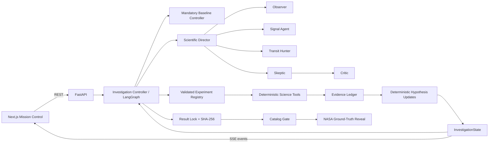
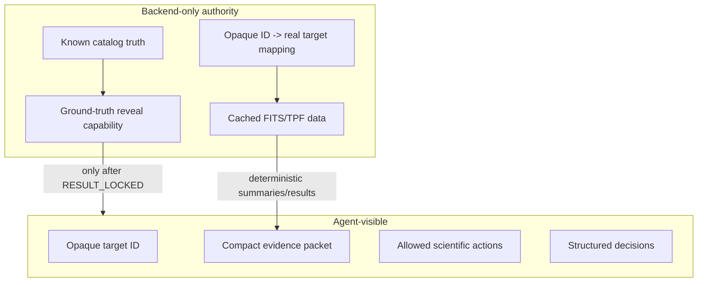

# Architecture

## Architectural principle

ExoSwarm is a deterministic scientific workflow with bounded agentic control at the decision points that benefit from interpretation and experiment selection.



## Responsibility split

### Deterministic application code owns

- data loading and caching,
- quality filtering and preprocessing execution,
- BLS and all numerical measurements,
- tool parameter validation and preconditions,
- mandatory baseline diagnostics,
- evidence serialization,
- hypothesis-state update rules,
- permissions and tool availability,
- max turns / experiment budget / repeated-action checks,
- result lock and hash,
- catalog gating and reveal authority,
- persistence and trace events,
- scientific numeric provenance guardrails.

### Models may own bounded judgment

- interpreting compact observation-quality summaries,
- choosing among allowed preprocessing strategies when genuinely evidence-dependent,
- selecting a candidate-related action from a bounded set,
- identifying the strongest unresolved alternative hypothesis,
- selecting one discriminating adaptive experiment,
- reviewing whether that experiment is redundant/informative,
- deciding to stop when the structured stopping conditions allow judgment,
- generating concise non-numeric UI explanations grounded in evidence.

## Manager + bounded specialists

The Scientific Director owns the investigation. Specialist contexts are isolated and narrow.

| Role | Primary objective | Typical output |
|---|---|---|
| Scientific Director | route the investigation and apply deterministic control policy | next phase / specialist / terminal transition |
| Observer | inspect compact data-quality evidence | quality/preparation decision |
| Signal Agent | choose among allowed preprocessing strategies | preprocessing decision |
| Transit Hunter | request candidate-search/measurement operations | candidate/tool decision |
| Skeptic | identify strongest non-planetary alternative and best discriminating experiment | `SkepticDecision` |
| Critic | test the proposed adaptive experiment for redundancy/information value | APPROVE / REVISE / VETO |

Specialists do not own the full conversation. They receive only task-relevant structured context.

## Mandatory vs adaptive science

Mandatory checks must not depend on the LLM remembering them. A viable transit candidate structurally requires:

- minimum signal-quality checks,
- odd/even comparison,
- secondary-eclipse test,
- basic contamination screening.

After the baseline, adaptive experiments may include harmonic checks, centroid localization, alternate aperture/preprocessing analysis, or STOP, subject to the bounded registry and current evidence.

## Explicit loop

```text
load durable run state
assemble compact role-specific context
ask bounded model for structured decision
validate schema + action + parameters + permissions + preconditions
if adaptive: ask Critic (max one revision)
execute deterministic tool
validate/normalize tool result
persist Evidence Ledger + trace + state
apply deterministic hypothesis updates
check mandatory completion / budgets / repeats / stopping conditions
continue, stop, fail, or lock
```

Every transition must have a visible state and terminal reason. Never rely on the model to notice that it is looping.

## Trust boundary



The runtime agent must not have an import path or tool path to pre-lock ground truth.

## Failure architecture

Do not collapse every failure into another LLM retry. Preserve typed classes such as:

- invalid input/action,
- precondition failed,
- not found/missing data,
- model timeout/invalid structured output,
- tool timeout/transient upstream failure,
- domain-level negative scientific result,
- partial/ambiguous result,
- authorization denied,
- budget exhausted,
- repeated action,
- insufficient evidence.

Only genuinely transient infrastructure failures should use bounded backoff.
